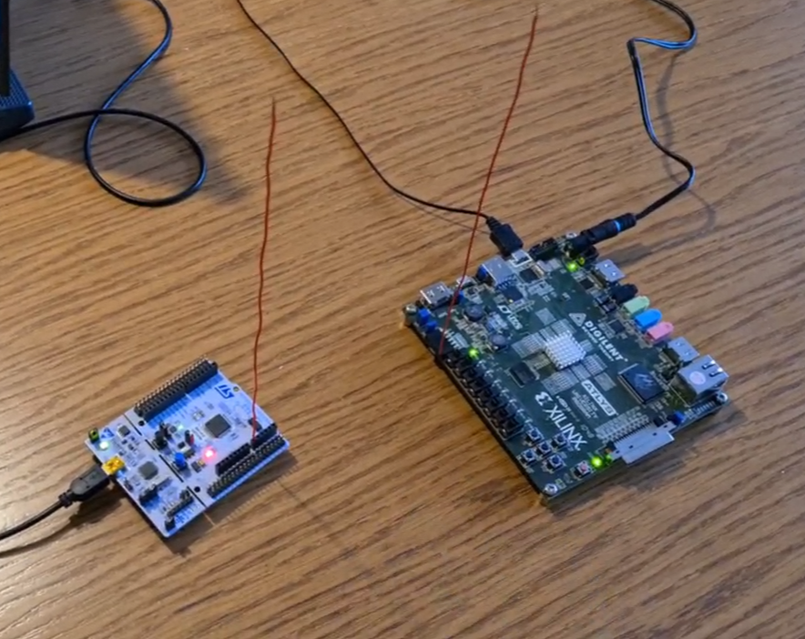

# Near Field Transmission Experiment

An experiment in which a digital signal is transmitted in the near field without any dedicated radio hardware.

*Hardware setup*

## Transmitter

The transmitter is an Alys Spartan 6 development board with a Xilinx FPGA. It is generating a frequency-modulated square signal, and sending it to the antenna pin.

## Receiver

The receiver is a NUCLEO-F411RE development board with an STM microcontroller. The receving antenna is connected to an A/D converter. Analog samples are fed into an FFT algorithm, using which the currently transmitted frequency can be estimated.

The detected frequency is sent to a computer over a serial connection, for presentation purposes.